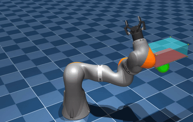

# *POLICEd-RL:* Learning Closed-Loop Robot Control Policies with Provable Satisfaction of Hard Constraints

 

## Overview
Repository containing code to implement [POLICEd RL](https://arxiv.org/pdf/2403.13297.pdf) presented at [RSS 2024](https://roboticsconference.org/).
The objective of POLICEd RL is to *guarantee* the satisfaction of an affine *hard constraint*
when learning a policy in closed-loop with a black-box deterministic environment.
The algorithm enforces a repulsive buffer in front of the constraint preventing trajectories to approach and violate this constraint.
To analytically verify constraint satisfaction, the policy is made affine in that repulsive buffer using the [POLICE](https://arxiv.org/pdf/2211.01340.pdf) algorithm.

POLICEd RL guarantees that this KUKA robotic arm will never cross the red surface when reaching for the green target thanks to the cyan repulsive buffer.

We provide the code for our implementation of POLICEd RL on several systems:
- an illustrative 2D system
- the CartPole
- the Gymnasium Inverted Pendulum
- a KUKA robotic arm

We illustrate POLICEd RL on a 2D system tasked with reaching a target location (cyan) without crossing a constraint line (red).
In the repulsive buffer (green) the policy is affine and learns to point away from the constraint.

## Organization
- [POLICEdRL](POLICEdRL) contains the project source code
- [scripts/examples.py](run/examples.py) provides several examples that exercise many
  aspects of the library.

## Credit
The following repositories have been instrumental from both an algorithms and
software architecture perspective in the development of this project:
- [RandallBalestriero/POLICE](https://github.com/RandallBalestriero/POLICE)
- [jachiam/CPO](https://github.com/jachiam/cpo)
- [jjyyxx/PPO-Barrier](https://github.com/jjyyxx/srlnbc)
- [sfujim/TD3](https://github.com/sfujim/TD3)
- [Lizhi-sjtu/PPO](https://github.com/Lizhi-sjtu/DRL-code-pytorch/tree/main/5.PPO-continuous)
